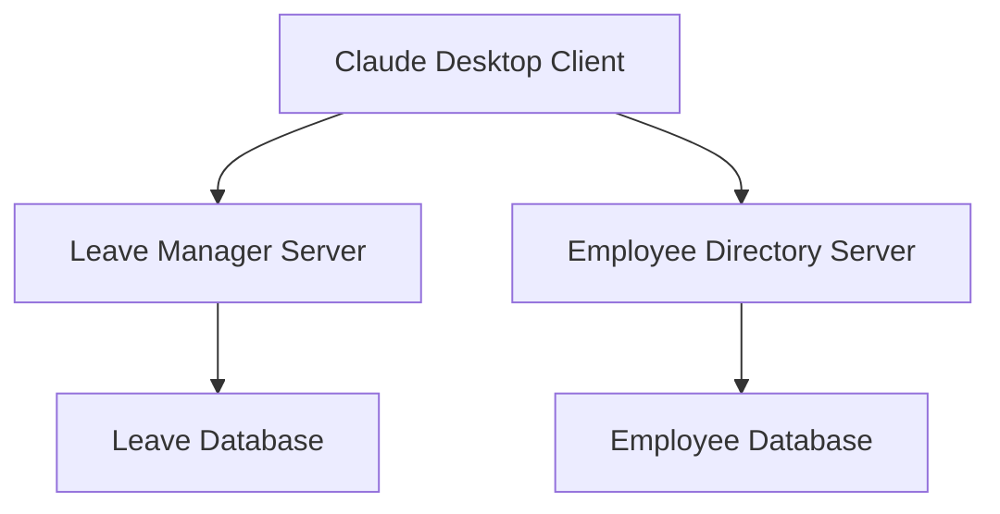

# Build Your First MCP Server: Leave Management

This project demonstrates how to build a **Model Context Protocol (MCP) server** for managing leave requests.  
The server interacts with a **mock leave database** and **mock employees database** and responds to queries from an MCP client that is Claude Desktop install locally on system.

---

## 🚀 Overview  
This AI-powered MCP server helps HR teams automate leave management tasks like:  
- Checking employee leave balances  
- Approving/rejecting leave requests  
- Viewing leave history
- Fetching Employee Info(Added to have multiple MCP server usecase)
- Updating Employee Phone Number (Added to have multiple MCP  server use cases)

---

## 🖼️ System Diagram  



This diagram shows how Claude Desktop communicates with your MCP server, which then interacts with a mock database.  

---

## 🛠️ Setup Instructions  

Follow these steps to set up and run the MCP server:  

1. **Install Claude Desktop**  
   Download and install [Claude Desktop](https://claude.ai).  

2. **Install `uv`**  
   ```bash
   pip install uv
   ```

3. **Initialize a New MCP Project**  
   ```bash
   uv init my-first-mcp-server
   ```

4. **Add the MCP CLI**  
   ```bash
   uv add "mcp[cli]"
   ```

5. **Fix Potential Type Errors (Optional)**  
   Some users may see type errors. Upgrade `typer` if needed:  
   ```bash
   pip install --upgrade typer
   ```

6. **Write the Server Code**  
   Implement your leave management server in `main.py`.  

7. **Install the Server in Claude Desktop**  
   ```bash
   uv run mcp install main.py
   ```

8. **Write the Server Code**  
   Implement your leave management server in `employee.py`.  

9. **Install the Server in Claude Desktop**  
   ```bash
   uv run mcp install employee.py

10. **Restart Claude Desktop**  
   - Kill any running Claude instance from **Task Manager**.  
   - Restart Claude Desktop.  

11. **Verify Installation**  
   You should now see **tools from this server** in Claude Desktop.  
   (Enable Developer Mode first) and the visit -> settings ->Developer
